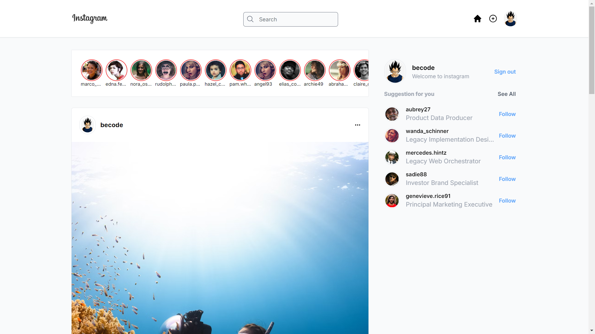

# Instagram Clone

Este é um projeto de clone do Instagram desenvolvido com Next.js, Firebase, TailwindCSS e TypeScript. O objetivo é criar interface inspirada no Instagram.

## Tecnologias Utilizadas

- **Next.js**: Framework React para construção de aplicações otimizadas para SEO e com renderização do lado do servidor.
- **Firebase**: Utilizado para autenticação, armazenamento de dados, e hospedagem.
- **TailwindCSS**: Framework CSS para estilização rápida e eficiente.
- **TypeScript**: Superset do JavaScript que adiciona tipagem estática ao código.

<!-- ## Funcionalidades

- Autenticação com Google (OAuth).
- Upload de imagens com Firebase Storage.
- Feed de publicações em tempo real.
- Curtir e comentar em postagens.
- Interface responsiva. -->

## Imagem da Aplicação



## Como Executar o Projeto Localmente

### Pré-requisitos

- Node.js >= 14.x
- Conta no Firebase com um projeto configurado
- Conta de desenvolvedor Google para usar o OAuth

### Variáveis de Ambiente

Crie um arquivo `.env.local` na raiz do projeto e adicione as seguintes variáveis de ambiente:

```bash
GOOGLE_CLIENT_ID=your_google_client_id
GOOGLE_CLIENT_SECRET=your_google_client_secret

FIREBASE_API_KEY=your_firebase_api_key
FIREBASE_AUTH_DOMAIN=your_firebase_auth_domain
FIREBASE_PROJECT_ID=your_firebase_project_id
FIREBASE_STORAGE_BUCKET=your_firebase_storage_bucket
FIREBASE_MESSAGE_SENDER_ID=your_firebase_message_sender_id
FIREBASE_APP_ID=your_firebase_app_id
```

### Instalação

1. Clone o repositório:
   ```bash
   git clone https://github.com/seu-usuario/instagram-clone.git
   cd instagram-clone
   ```

2. Instale as dependências:
   ```bash
   npm install
   ```

3. Execute o projeto:
   ```bash
   npm run dev
   ```

4. Abra no navegador: [http://localhost:3000](http://localhost:3000)

### Configuração do Firebase

1. Acesse o [Firebase Console](https://console.firebase.google.com/).
2. Crie um novo projeto ou utilize um projeto existente.
3. No painel do Firebase, habilite a autenticação com Google e configure o Firebase Firestore e Storage.
4. Atualize as variáveis de ambiente com as informações do Firebase.

## Contribuição

Contribuições são bem-vindas! Se você quiser melhorar este projeto, sinta-se à vontade para enviar um pull request.
